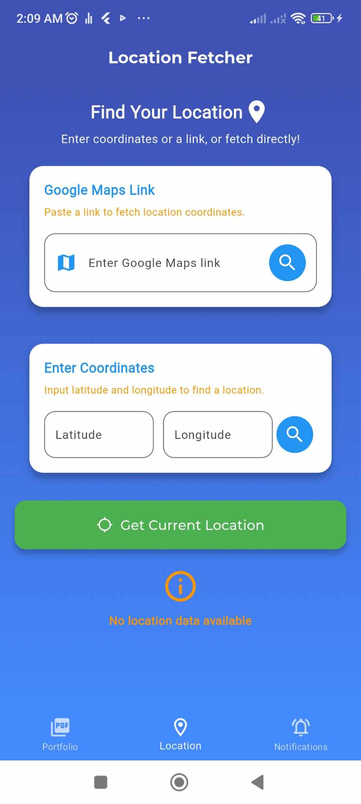

# Portfolio, Location, and Notification App

This Flutter app is designed with three primary functionalities:

1. **Portfolio Generator**: Users can input their details, generate a portfolio in both Arabic and English, and save, view, or share it.
2. **Location Fetcher**: Users can fetch their location using a Google Maps link, coordinates, or their current location.
3. **Notification Manager**: Users can set instant, repeated, or scheduled notifications. Notifications can also be canceled individually by ID or all at once, with pending notifications displayed.

## Features

### 1. Portfolio Generator

- Input details such as:
    - Full Name
    - Contact Information
    - Work Experience
    - Education
    - Skills
- Language support for **English** and **Arabic**.
- Generate a PDF portfolio and save or share it directly.

### 2. Location Fetcher

- **Google Maps Link**: Paste a link to fetch the coordinates.
- **Enter Coordinates**: Input latitude and longitude to locate a place.
- **Current Location**: Fetch your current location automatically.
- Displays detailed information, including:
    - Latitude and Longitude
    - Address

### 3. Notification Manager

- **Instant Notifications**: Trigger a notification immediately.
- **Repeated Notifications**: Schedule notifications to repeat.
- **Scheduled Notifications**: Set a specific time for notifications.
- **Cancel Notifications**:
    - Cancel by ID.
    - Cancel all notifications.
    - Display pending notifications.

